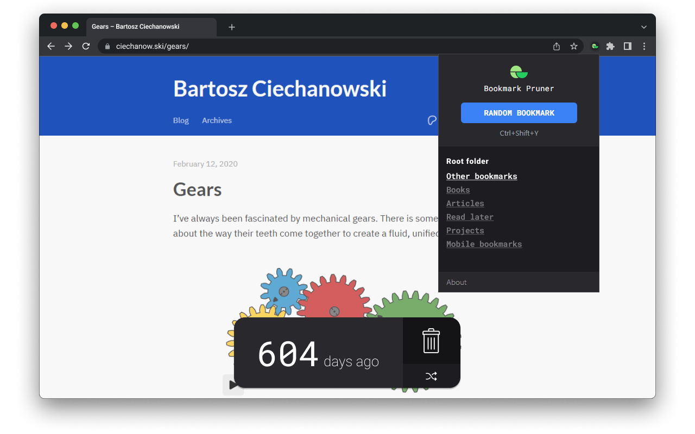

# Bookmark Pruner

A low-effort solution for dealing with your ever-growing collection of bookmarks.

Available on the [Chrome Web Store](https://chromewebstore.google.com/detail/bookmark-pruner/kcchbjeaiekpkfmafbmbbgokifliadil) and [Add-ons for Firefox](https://addons.mozilla.org/en-US/firefox/addon/bookmark-pruner/).



## About

A web extension for:

- **Pruning those old bookmarks** you told yourself you'd read on the weekend, _two years ago_.
- **Rediscovering** interesting content lost to bookmark oblivion.
- Or just **aimlessly navigating** your bookmark collection.

### How to use

1. **Load a random bookmark:** Use either the extension's popup panel or the keyboard shortcut (default is `Ctrl + Shift + Y`)
2. **Prune or keep:** Decide if you'll keep the bookmark, or if it's time to remove it from your collection.
3. **Repeat:** Load the next random bookmark and keep on pruning.

If you wish, you can **change the root folder** to restrict which bookmarks are selected by the extension. This setting is available in the popup panel.

## Development

This is a [Plasmo extension](https://docs.plasmo.com/) project bootstrapped with [`plasmo init`](https://www.npmjs.com/package/plasmo).

```bash
pnpm dev
# or
npm run dev
```

For further guidance, [visit the Plasmo Docs](https://docs.plasmo.com/).

## License

© Pedro Martins. MIT License.

## Credits

- "Delete" icon by <a href="https://www.flaticon.com/free-icons/remove" title="remove icons">DinosoftLabs</a>.
- "Random" icon by <a href="https://www.flaticon.com/free-icons/random" title="random icons">Icon mania</a>
