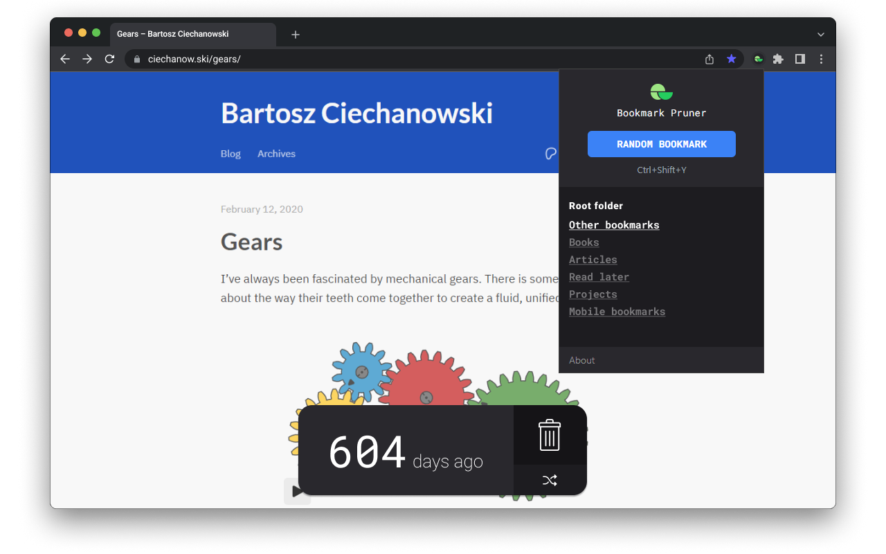

# Bookmark Pruner

A low-effort solution for dealing with your ever-growing collection of bookmarks.

<!-- [TODO: Link to Chrome] / [TODO: Link to Firefox] -->

Soon available on the **Chrome Web Store** and **Firefox Addons**.



## About

A web extension for:

- **Pruning those old bookmarks** you told yourself you'd read on the weekend, _two years ago_.
- **Rediscovering** interesting content lost to bookmark oblivion.
- Or simply **aimlessly navigating** your bookmark collection.

### How to use

1. **Load a random bookmark:** use either the extension's popup panel or the keyboard shortcut (default is `Ctrl + Shift + Y`)
2. **Prune or keep:** either delete the current bookmark or load the next random one.

If you wish, you can **change the root folder** to restrict which bookmarks are selected by Bookmark Pruner. This setting is available in the popup panel.

## Development

This is a [Plasmo extension](https://docs.plasmo.com/) project bootstrapped with [`plasmo init`](https://www.npmjs.com/package/plasmo).

```bash
pnpm dev
# or
npm run dev
```

For further guidance, [visit the Plasmo Docs](https://docs.plasmo.com/).

## License

© Pedro Martins. MIT License.

## Credits

- "Delete" icon by <a href="https://www.flaticon.com/free-icons/remove" title="remove icons">DinosoftLabs</a>.
- "Random" icon by <a href="https://www.flaticon.com/free-icons/random" title="random icons">Icon mania</a>
